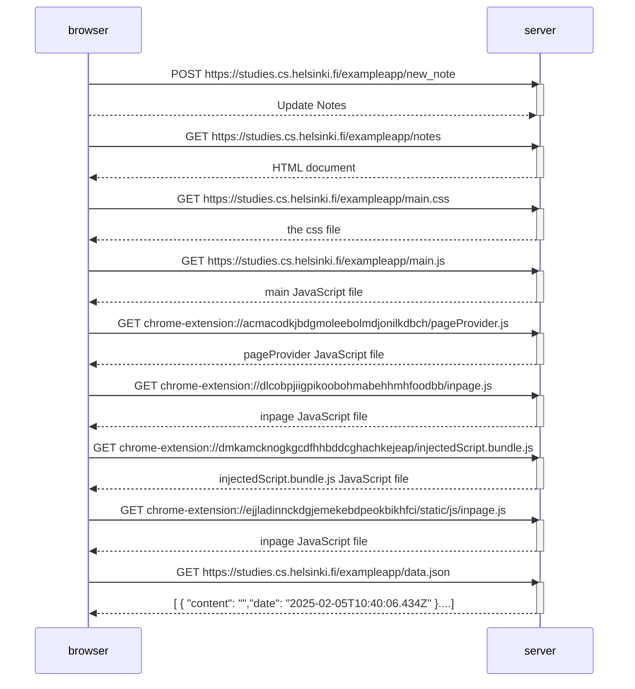

```mermaid
   sequenceDiagram
    participant browser
    participant server

    browser->>server: POST https://studies.cs.helsinki.fi/exampleapp/new_note
    activate server
    browser-->>server: Update Notes
    deactivate server


    browser->>server: GET https://studies.cs.helsinki.fi/exampleapp/notes
    activate server
    server-->>browser: HTML document
    deactivate server

    browser->>server: GET https://studies.cs.helsinki.fi/exampleapp/main.css
    activate server
    server-->>browser: the css file
    deactivate server

    browser->>server: GET https://studies.cs.helsinki.fi/exampleapp/main.js
    activate server
    server-->>browser: main JavaScript file
    deactivate server

    browser->>server: GET chrome-extension://acmacodkjbdgmoleebolmdjonilkdbch/pageProvider.js
    activate server
    server-->>browser: pageProvider JavaScript file
    deactivate server

    browser->>server: GET chrome-extension://dlcobpjiigpikoobohmabehhmhfoodbb/inpage.js
    activate server
    server-->>browser: inpage JavaScript file
    deactivate server


    browser->>server: GET chrome-extension://dmkamcknogkgcdfhhbddcghachkejeap/injectedScript.bundle.js
    activate server
    server-->>browser: injectedScript.bundle.js JavaScript file
    deactivate server

    browser->>server: GET chrome-extension://ejjladinnckdgjemekebdpeokbikhfci/static/js/inpage.js
    activate server
    server-->>browser: inpage JavaScript file
    deactivate server


    browser->>server: GET https://studies.cs.helsinki.fi/exampleapp/data.json
    activate server
    server-->>browser: [ { "content": "","date": "2025-02-05T10:40:06.434Z" }....]
    deactivate server

```
